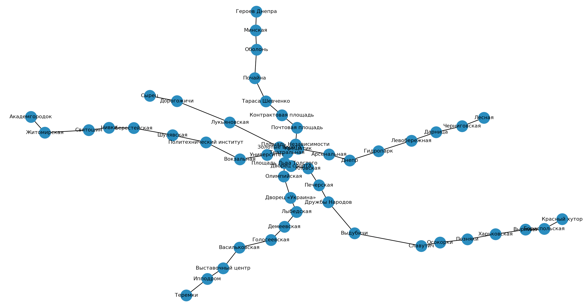

# This is a Kyiv Subway Scheme

# First of all
Clone this repository

```
git@github.com:sonerayberk/goldiepython.git
```

Install required packages

```
pip install networkx matplotlib
```

# Run a script
Paradoxically

```
python main.py
```

# See the result

